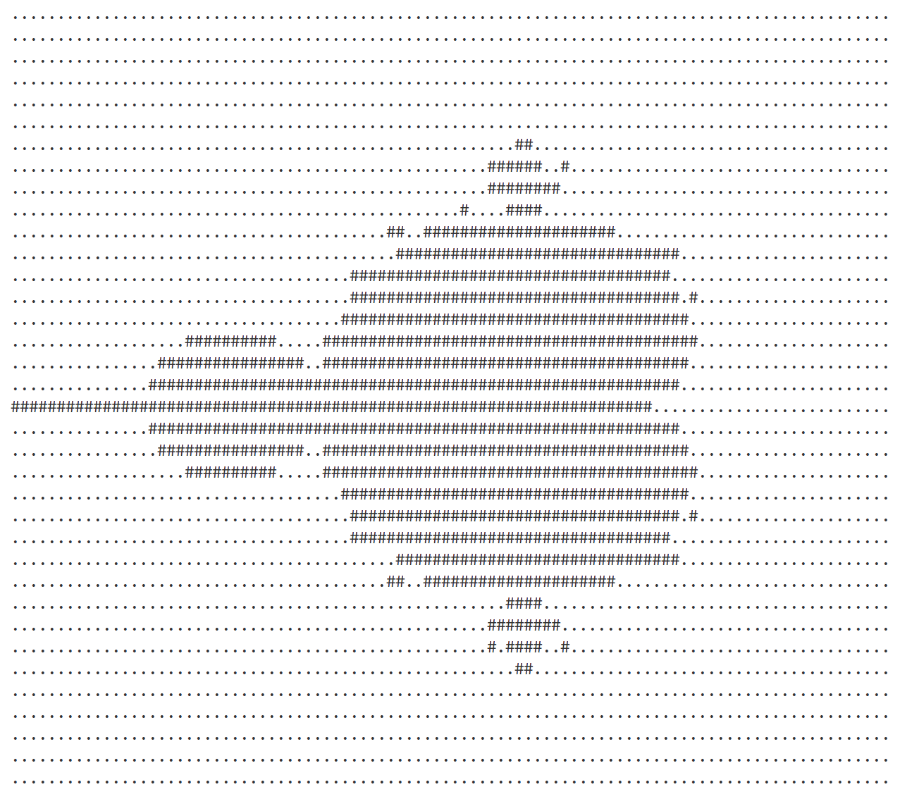
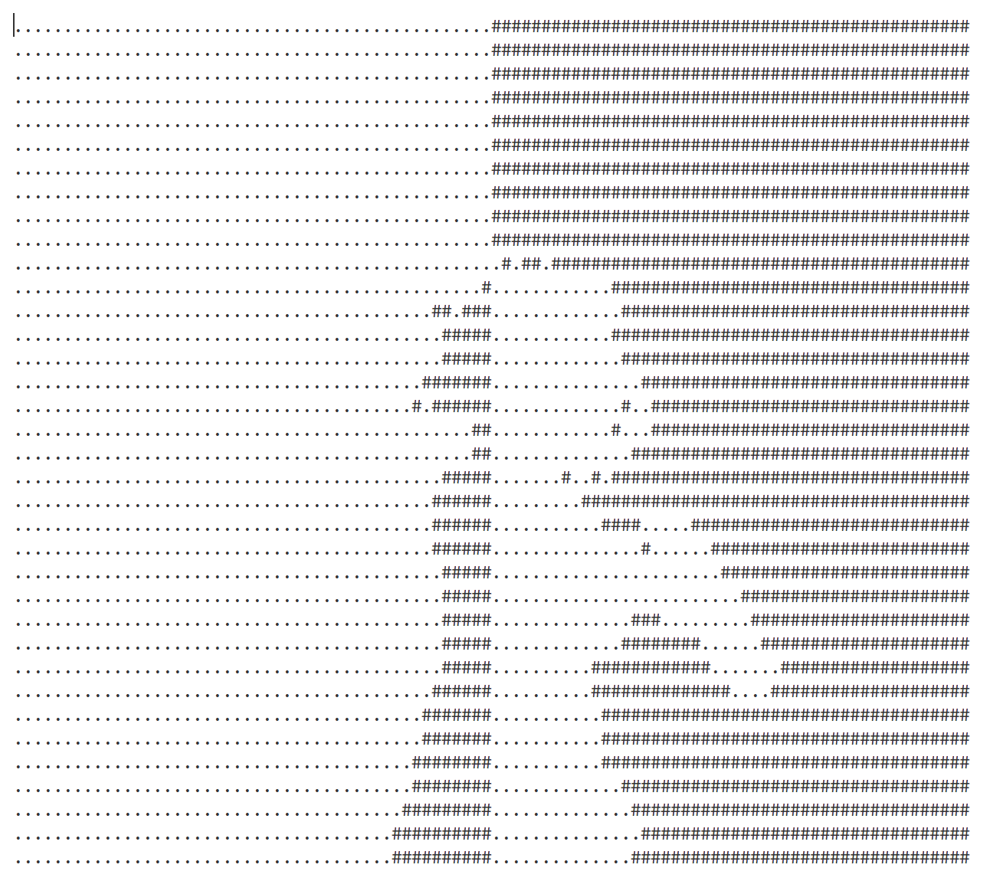

# Processor
**SPU** - software processing unit.

Runs programs written in assembler-like language.

+ built-in stack, registers and RAM.

+ jumps and function calls

+ some graphics using `draw` and `drawr` commands

+ **Comes with simple DSL to create new commands**

**NOTE**: Numbers are fixed-point. Precision is set by `FP_EXPONENT` constant in `global/include/cpuCommands.h`.

**WARNING**: processor uses some system-dependent libraries, like `unistd.h` and `sys/time.h`, so it works **ONLY** on LINUX.

## Build
 + Compile all (spu + assembler + disassembler)
    + `make`

 + Compile just the program you want with
    + `make asm`
    + `make spu`
    + `make dsm`

 + Delete object files with
    + `make clean`

**NOTE**

+ `RELEASE` version works much faster, to build it add `BUILD=RELEASE` in make flag:
    + `make BUILD=RELEASE`

## How to use:

Usage:
```
./<programName> [args]... file
```

`file` can be anywhere in arguments, program will take first non-flag argument

`file` is name of input file, has higher priority then `--input` flag

Use `-h` or `--help` to find other flags

Here's some usage examples:

### Processor
```
./spu.out file
```
You can activate logger using `-d` flag

### Assembler
```
./asm.out file -o <outputFile>
```
`-o` flag is optional, without it output file will have the same name as input, but with extension `.lol`

You can activate logger using `-d` flag:
1. `-d 1` prints some debug info
2. `-d 2` logs every step of assembling

### Disassembler
```
./dsm.out -o <outputFile> file
```
`-o` flag is optional, without it output file will have the same name as input, but will end with `_D.asm`

## Examples

You can try programs from `asmProgs/` folder:

+ Mandelbrot.lol



+ SqSolve.lol
    + Solves quadratic equation

Bad apple: `make badApple`

 + `./spu.out bad-apple-converter/badApple.asm`

 
 badApple program from `bad-apple-converter/badApple.asm`
